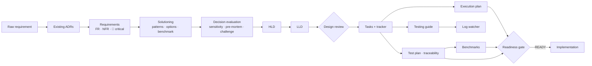

# devkit — requirement-to-delivery kit for Claude Code

**devkit** turns a raw requirement into a reviewed, traceable plan and verified delivery, inside [Claude Code](https://claude.com/claude-code).

You give Claude a requirement. devkit then:
- breaks it into functional and non-functional requirements, and flags the critical ones;
- checks the architecture decisions (ADRs) your repo has already made;
- compares solution options using standard design patterns and benchmarks;
- writes the HLD and LLD, with Mermaid diagrams;
- breaks the work into tracked tasks, with an execution plan, a testing guide and a test plan;
- sets up benchmarks and a log watcher for local testing;
- **refuses to start implementation until the design has been reviewed and every decision has been evaluated and accepted by a human.**

All documents are written into **your** repo from fixed templates, grouped per feature, so every feature's paperwork looks the same and stays checkable.



## Contents
- [Prerequisites](#prerequisites)
- [Quick start](#quick-start)
- [Your first feature, step by step](#your-first-feature-step-by-step)
- [Example: a full run](#example-a-full-run)
- [Day-to-day commands](#day-to-day-commands)
- [Troubleshooting](#troubleshooting)
- [Review before implementing & thorough decisions](#review-before-implementing--thorough-decisions)
- [Where the documents go](#where-the-markdown-gets-generated)
- [Architecture decisions (ADRs)](#architecture-decisions-adrs)
- [Consistent document formats](#consistent-document-formats)
- [What's inside](#whats-inside) · [Tools reference](#tools-devkittools-python-310-no-dependencies) · [Development](#development)

## Prerequisites
- **Claude Code**: the CLI, the desktop app or an IDE extension.
- **Python 3.10+**: `python3 --version`. The kit has no other dependencies.
- **pipx** (recommended), to install the `devkit` command: `brew install pipx && pipx ensurepath` (macOS), or `python3 -m pip install --user pipx && python3 -m pipx ensurepath`.
- **git**: the target repo should be a git repository; devkit anchors on its root.

## Quick start

### 1. Install the `devkit` command (once per machine)
```bash
pipx install git+https://github.com/rajathnavda1729/devsupport.git
devkit --help
```
Alternatives:
- `pip install git+https://github.com/rajathnavda1729/devsupport.git`
- `git clone https://github.com/rajathnavda1729/devsupport.git`, then run `./devsupport/bin/devkit …` with no install at all.

### 2. Add devkit to the repo where the work will be built
```bash
cd /path/to/your-repo
devkit install --dry-run     # 1. review: every file to be added, settings merge, CLAUDE.md section
devkit diff                  # 2. optional: exact content changes
devkit install               # 3. apply (asks to confirm; use --yes in scripts)
devkit doctor                # 4. verify
```
This adds the following to your repo; commit them:
- `.claude/skills`, `.claude/agents`, `.claude/rules`;
- the hooks, in `.claude/settings.json` (your own entries are kept);
- `devkit/`, which holds the tools and templates;
- a short section in `CLAUDE.md`;
- `.devkit.json`.

Useful options:
- `--specs-dir docs/specs` puts feature documents somewhere other than `specs/`.
- `--user` also makes the skills available in all your projects.

> Restart Claude Code (or open a new session) in the repo afterwards so it picks up the new skills, agents and hooks.

### 3. Start a feature in Claude Code
```text
/devkit payment-retry Retry failed card payments up to 3 times with backoff; never double-charge.
```
You can also point it at a file: `/devkit payment-retry docs/prd/retry.md`.

## Your first feature, step by step
Here is what happens after `/devkit`, and what Claude needs from you:

| Step | What Claude does | What you do |
|------|------------------|-------------|
| 0 | Scans existing ADRs (`devkit adr scan`). Picks where the docs live: repo `specs/`, or next to the owning module, e.g. `services/payments/specs/payment-retry/` | Confirm the location if asked |
| 1 | Writes `01-requirements/requirements.md`: FR/NFR, 🔴 critical items, assumptions, open questions | **Answer the open questions, then reply "approved"** |
| 2 | Writes `02-design/solutioning.md`: prior ADRs, patterns, ≥2 options, weighted comparison, benchmarks. Drafts ADRs and runs the sensitivity check and the `decision-challenger` review | **Approve the solutioning, and accept each ADR** ("accept ADR-0007", or `devkit adr set-status 7 accepted`) |
| 3–4 | Writes `02-design/hld.md` and `lld.md` with Mermaid diagrams | **Approve the LLD** |
| 4.5 | The `design-reviewer` agent writes `02-design/reviews/design-review.md` | Agree to the fixes for its blocking findings |
| 5–9 | Tasks (`03-delivery/TASKS.md`), execution plan, testing guide, test plan, traceability, benchmark plan, log-watcher profile | Review |
| 10 | Runs `devkit review payment-retry`, the **readiness gate** | Implementation can start once it reports **READY** |

At any point, ask "where are we on payment-retry?" or run `devkit status payment-retry`. Each feature folder has a generated `README.md` that indexes all of its documents and decisions.

> **Approvals are yours.** Claude is instructed never to mark a document *Approved* or an ADR *Accepted* unless you say so. The readiness gate checks for both.

Prefer to run one stage on its own? Every stage is its own skill: `/requirements-breakdown`, `/solutioning`, `/hld`, `/lld`, `/task-breakdown`, `/execution-plan`, `/testing-guide`, `/test-plan`, `/benchmark`, `/log-watcher`, `/adr-discovery`, `/implementation-readiness`.

## Example: a full run
[`examples/leaderboard/`](examples/leaderboard/WALKTHROUGH.md) takes a **near-realtime leaderboard** from a raw request to an implementation-ready plan. It covers requirements, three rounds of decision challenges (the chosen design changed twice), HLD/LLD, design review, tasks, a schedule that honestly misses the deadline, the test plan, proof-of-concept benchmarks and the readiness gate. Start with the walkthrough.

## Day-to-day commands
```bash
devkit list                                   # all feature workspaces
devkit status payment-retry                   # which documents are missing / draft / filled
devkit review payment-retry                   # readiness gate (exit 1 = not ready)
devkit review matrix payment-retry            # option scores, margin, sensitivity
devkit review decision ADR-0007               # is this decision thoroughly evaluated?
devkit adr search retry idempotency           # what has the repo already decided?
devkit task -f payment-retry next             # what to work on
devkit task -f payment-retry start T-003      # blocked until the gate passes (spikes exempt)
devkit task -f payment-retry done T-003 --note "PR #42"
devkit lint --feature payment-retry           # documents still match their templates?
devkit logs --cmd "npm run dev"               # watch logs while testing locally
devkit bench http --name create --url http://localhost:8080/x -n 200 --slo "p95_ms<=150"
devkit update                                 # after `pipx upgrade devkit-cli`; local edits are kept
```
Every `devkit <cmd>` maps to a tool in `devkit/tools/`, so `python3 devkit/tools/<tool>.py …` works too. That form is what the skills use.

## Troubleshooting
| Symptom | Fix |
|---------|-----|
| `/devkit` isn't recognised in Claude Code | Run `devkit doctor`, then restart Claude Code in the repo root. For skills everywhere, run `devkit install --user` |
| `devkit: command not found` | `pipx ensurepath`, then open a new terminal. Or use `./bin/devkit` from a clone |
| `devkit install` says "re-run with --yes" | It was run without a terminal (CI or a script). Review the plan, then add `--yes` |
| "conflict … edited locally — kept" on update | You changed an installed file. Use `devkit diff <name>` to compare, then keep yours or run `devkit update --force` |
| `task start` says "not ready for implementation" | Run `devkit review <slug>` and fix what it lists. Only for an emergency: `--force --note "<who approved, why>"`, which is recorded |
| Claude's edit fails with "no longer matches its template" | Working as intended: the lint hook found format drift, and Claude should fix the section. See [Consistent document formats](#consistent-document-formats) |
| "TASKS.md is generated by devkit" | Change tasks through `devkit task …`, not by editing the file |
| Remove devkit | `devkit uninstall`. Your feature documents, ADRs and `.devkit.json` are never removed |

## Review before implementing & thorough decisions
**Readiness gate.** `devkit review <slug>` writes `03-delivery/readiness.md`. It passes only when **all** of these hold:

| Check | Requirement |
|-------|-------------|
| Design documents approved | requirements, solutioning, HLD and LLD are *Approved* by the user; the execution and test plans are at least in *Review* |
| Blocking open questions answered | every *Blocking? Yes* question in requirements §10 has an answer |
| Design review | the `design-reviewer` verdict is APPROVE, and every blocking finding is resolved |
| Options thoroughly compared | weights sum to 100; ≥2 scored options; ≥1 rejected alternative; the winner survives the **±20% weight sensitivity** check; a margin under 10% or a fragile winner needs a **PoC benchmark result** or an explicit `**Override:**`; the recommendation matches the winner |
| Prior decisions respected | no conflicts with Accepted ADRs; the decision context is recorded; the HLD and LLD apply only decisions in force, so they can't be stale against the chosen solution |
| Decisions evaluated and accepted | each feature ADR has options, drivers, trade-offs, evidence quality, reversibility (one- or two-way door), a pre-mortem and a challenge, and is **Accepted by a human**. Rejected or superseded ADRs stay as records and don't block |
| Documents match templates | 0 lint errors |
| Tasks valid | dependencies, cycles, critical-requirement coverage |

`tracker.py start` (`devkit task … start`) refuses every non-spike task until the gate passes. A bypass needs `--force --note "<who/why>"` and is recorded on the task.

**Thorough evaluation** is covered by the `decision-evaluation` skill and the `decision-challenger` agent. The challenger argues against the chosen option: missing options, scoring bias, weak evidence, failure modes, exit cost and conflicts with existing ADRs. Its strongest objection, and the response to it, are recorded in the ADR.

### Where the markdown gets generated
All artifacts are written **inside the target repo**. Tools anchor on the repo root (`.devkit.json`, else `.git`), so running them from a subdirectory never scatters files.

| Situation | Command (the `devkit` skill picks this for you) | Workspace |
|-----------|--------------------------------------------------|-----------|
| Single app, or cross-cutting change | `devkit new checkout-v2` | `specs/checkout-v2/` (or the `specs_dir` set in `.devkit.json`) |
| One module/service owns it (monorepo) | `devkit new payment-retry --at services/payments` | `services/payments/specs/payment-retry/` |

Workspaces created with `--at` are registered in `.devkit.json`, so `devkit task -f <slug>`, `devkit status/doc/where <slug>` and every skill find them by slug. Commit them alongside the code.

```text
target-repo/
├── .devkit.json                       # {"specs_dir": "specs", "decisions_dir": "docs/adr", "features": {"payment-retry": "services/payments/specs/payment-retry"}}
├── docs/adr/                          # repo-wide ADRs (or your existing ADR folder) + generated decision-log.md
├── specs/checkout-v2/                 # grouped feature workspace (below)
└── services/payments/
    ├── src/…
    └── specs/payment-retry/           # docs live next to the code that realises them
```

### How a feature workspace is grouped
```text
<ws>/
├── README.md                          # generated index: every document, its state/status, related ADRs
├── 01-requirements/   input.md · requirements.md
├── 02-design/         solutioning.md · hld.md · lld.md
│   ├── decisions/     ADR-00NN-*.md (feature-scoped ADRs)
│   └── reviews/       design-review.md
├── 03-delivery/       tasks.json · TASKS.md · execution-plan.md
└── 04-quality/        testing-guide.md · test-plan.md · traceability.md · benchmark-plan.md · test-report.md
    └── benchmarks/    *.json · REPORT.md · log-report.md
```
The layout, every document type and its template are defined in one place, `devkit/templates/manifest.json`. Run `devkit types` to list them.

## Architecture decisions (ADRs)
Decisions recorded earlier in the target repo are found and taken into account before any design work.
- **Detect.** `adr.py scan` finds ADRs in any common format (Nygard/adr-tools, MADR 2/3, Y-statements, devkit) and any usual location (`.adr-dir`, `docs/adr`, `doc/architecture/decisions`, `decisions/`, feature `decisions/`). It parses their number, title, status, date, tags and supersession, and writes a generated **decision log** (`decision-log.md` + `.json`).
- **Document what is missing.** The `adr-discovery` skill, or the `decision-archaeologist` agent, finds decisions in force in the code that were never recorded. It proposes them with `file:line` evidence and, once you confirm, writes them as *retroactive* ADRs.
- **Apply.**
  - Solutioning §1 must list the relevant ADRs and their impact (constrains / complies / supersedes).
  - HLD §2 and LLD §13 show where each one is honoured.
  - The design reviewer checks compliance.
  - `adr.py check <slug>` fails if a document cites an ADR that does not exist, or forgets the decision context.
- **Record.**
  - The `adr-author` skill creates new ADRs from the template. Numbering is global across the repo and follows the repo's file naming (`0007-…` or `ADR-0007-…`).
  - Changing an Accepted decision requires a superseding ADR and your approval. The old ADR is marked automatically, in its own format.

## Consistent document formats
Every document is created from a template and stays in that format:
- Line 1 of each document is a marker, `<!-- devkit:doc type=hld v=1 -->`, that names its template.
- `doclint.py` checks that each document matches its template:
  - the H1 prefix, the header fields and a valid status;
  - every H2 section, in order, with no extra H2s (extra detail goes under `###`);
  - identical table columns;
  - the mermaid diagrams the template requires;
  - no TODOs once a document is in Review or Approved.
- **Hooks.**
  - After every write, the lint hook checks the document and sends any errors straight back to Claude. It also refreshes the workspace `README.md` index.
  - Generated documents (`TASKS.md`, `traceability.md`, the index, the decision log) can't be hand-edited; a guard hook blocks it.
  - Editing an *Approved* document or an *Accepted* ADR asks you to confirm first, because approval is yours.
- **Templates** (`devkit/templates/`): requirements, solutioning, hld, lld, design-review, execution-plan, testing-guide, test-plan, benchmark-plan, test-report and ADR. Add new document types with `kit-forge`.

## What's inside

### Skills (`.claude/skills/`)
| Skill | Purpose | Output |
|-------|---------|--------|
| `devkit` | Orchestrates the whole pipeline with approval and format gates; resumes where you left off | all documents |
| `adr-discovery` | Detects existing ADRs (any format), builds the decision log, and documents unrecorded decisions as retroactive ADRs | `<decisions_dir>/decision-log.md`, ADRs |
| `adr-author` | Records, accepts or supersedes decisions with the ADR template and global numbering | ADR files |
| `decision-evaluation` | Weighted comparison, sensitivity, evidence quality, reversibility, pre-mortem, challenge; ends in human acceptance | solutioning §6–§9, ADR *Evaluation* |
| `implementation-readiness` | Review-before-implementing gate; drives the fixes until READY | `03-delivery/readiness.md` |
| `requirements-breakdown` | FR/NFR with IDs, MoSCoW, Given/When/Then, **critical requirements**, assumptions, open questions | `01-requirements/requirements.md` |
| `solutioning` | Prior ADRs → drivers → design-pattern matching → options → weighted comparison → industry and PoC benchmarks → ADRs | `02-design/solutioning.md`, `02-design/decisions/` |
| `hld` | C4 context and containers, sequence flows, data, interfaces, deployment, NFR realisation, critical guards (mermaid) | `02-design/hld.md` |
| `lld` | Modules, class diagrams, API contracts, ER model, state machines, error handling, concurrency, config, logging | `02-design/lld.md` |
| `task-breakdown` | Thin vertical slices linked to requirements, loaded into the tracker | `03-delivery/tasks.json`, `TASKS.md` |
| `task-tracker` | Day-to-day tracker operation: next, start, done, block, board, graph, waves | `TASKS.md` |
| `execution-plan` | Milestones, parallel waves, gantt, critical path, risks, rollout and rollback, DoD | `03-delivery/execution-plan.md` |
| `testing-guide` | Local setup, test pyramid, commands, log watching, debugging, CI | `04-quality/testing-guide.md` |
| `test-plan` | TC-### cases mapped to FR/NFR, risk-based, critical coverage, traceability matrix | `04-quality/test-plan.md`, `traceability.md` |
| `benchmark` | NFR → SLO gates, command and HTTP benchmarks, baseline regression, option comparison | `04-quality/benchmark-plan.md`, `benchmarks/` |
| `log-watcher` | Discovers log sources, generates alert rules from the LLD and critical requirements, runs live or as a gate | `devkit/config/logwatch.*.json` |
| `kit-forge` | Generates new skills, agents, rules and **document types** (template + manifest entry) | `.claude/...`, `devkit/templates/` |

### Sub-agents (`.claude/agents/`)
| Agent | Stages | Tools |
|-------|--------|-------|
| `decision-archaeologist` | 0.5 (existing decisions) | read/write |
| `decision-challenger` | 2.5 (red-teams each significant decision) | **read-only**, web |
| `requirements-analyst` | 1 | read/write |
| `solution-architect` | 2–3 | read/write, web |
| `detailed-designer` | 4 | read/write |
| `design-reviewer` | review gate (incl. ADR compliance) | read + writes only the review doc |
| `delivery-planner` | 5–6 | read/write |
| `qa-strategist` | 7–8 | read/write |
| `performance-engineer` | 9 + log watcher | read/write |

### Rules (`.claude/rules/`)
`devkit-artifacts` · `document-format` · `architecture-decisions` · `review-before-implementing` · `requirements-quality` · `design-decisions` · `task-tracking` · `testing-and-verification`.

Hooks:
- `devkit/hooks/guard_generated.py` (PreToolUse) blocks hand-edits to generated files.
- `devkit/hooks/lint_doc.py` (PostToolUse) lints each document as it is written and refreshes the index.

### Knowledge base (`devkit/knowledge/`)
- `design-patterns.md`: maps problem signals to patterns, and covers architectural styles, distributed-data, resilience and GoF patterns, plus a fit checklist.
- `nfr-checklist.md`: ISO 25010 categories, probing questions, and metric/target examples.
- `criticality-rubric.md`: a 7-dimension scoring rubric that decides what is CRITICAL.
- `mermaid-conventions.md`: which diagram to use for which question, syntax rules and snippets.

## Tools (`devkit/tools/`, Python 3.10+, no dependencies)
Reference for the tools behind the `devkit` commands (`devkit new` → `scaffold.py new`, `devkit task` → `tracker.py`, `devkit adr` → `adr.py`, `devkit lint` → `doclint.py`, `devkit review` → `review.py`, `devkit bench` → `bench.py`, `devkit logs` → `logwatch.py`).


### `scaffold.py`: workspaces
```bash
python3 devkit/tools/scaffold.py init --specs-dir docs/specs                   # once: default location
python3 devkit/tools/scaffold.py new <slug> --title "Title" --input req.md   # or --text "..."
python3 devkit/tools/scaffold.py new <slug> --at services/payments --text "…"  # next to the module
python3 devkit/tools/scaffold.py where <slug>      # print workspace path
python3 devkit/tools/scaffold.py status <slug>     # missing / draft / filled per document + next step
python3 devkit/tools/scaffold.py doc <slug> test-report   # create an on-demand document from its template
python3 devkit/tools/scaffold.py types             # document types, templates, locations
python3 devkit/tools/scaffold.py index <slug>      # regenerate the workspace README index
python3 devkit/tools/scaffold.py migrate <slug>    # move a flat (older) workspace into the grouped layout
python3 devkit/tools/scaffold.py list
```

### `adr.py`: architecture decisions
```bash
python3 devkit/tools/adr.py scan                              # detect ADRs, write decision log
python3 devkit/tools/adr.py list --status accepted
python3 devkit/tools/adr.py search payments idempotency       # relevant prior decisions
python3 devkit/tools/adr.py new --title "Use outbox for events" [--feature <slug>] [--tags a,b] [--supersedes 4]
python3 devkit/tools/adr.py new --title "PostgreSQL is the system of record" --retroactive
python3 devkit/tools/adr.py set-status 12 accepted | supersede 4 12 | show 12
python3 devkit/tools/adr.py retitle 12 --title "…"           # Proposed ADRs only, after a revision
python3 devkit/tools/adr.py check <slug>                      # feature cites valid, in-force ADRs; HLD/LLD apply only live decisions
```

### `doclint.py`: document format
```bash
python3 devkit/tools/doclint.py                      # every devkit document in the repo
python3 devkit/tools/doclint.py --feature <slug>     # one workspace (exit 1 on errors; --strict for warnings)
python3 devkit/tools/doclint.py --feature <slug> --render   # also render every mermaid block (needs mermaid-cli)
```

### `review.py`: decision evaluation & readiness gate
```bash
python3 devkit/tools/review.py matrix <slug>       # totals, margin, ±20% weight + ±1 score sensitivity, evidence/fallback for close calls
python3 devkit/tools/review.py decision ADR-0007   # is the ADR thoroughly evaluated?
python3 devkit/tools/review.py readiness <slug>    # review before implementing (exit 1 = not ready)
```

### `tracker.py`: task tracker
```bash
T="python3 devkit/tools/tracker.py -f <slug>"
$T import tasks.draft.json          # bulk add/update
$T add --title "..." --type feature --priority P0 --estimate S --reqs FR-001 --deps T-001 -a "criterion"
$T next | start T-002 | review T-002 | done T-002 --note "PR #4" | block T-003 --note "why" | cancel
$T list --status blocked | show T-002 | stats | board | graph | waves [--json]
$T validate                         # cycles, unknown deps, CRITICAL reqs without task/test → exit 1
$T schedule --start 2026-10-12 --team 3 --focus 0.7 --deadline 2026-11-20 [--phases M1,M2] [--mermaid]
                                    # assign tasks to engineers, finish date, deadline check, generated gantt
$T trace                            # requirement → tasks → test cases matrix
```
`TASKS.md` is regenerated on every change. It contains a progress bar, swim-lanes (in progress / review / blocked / ready / waiting / done), a mermaid dependency graph, execution waves and the critical path.

### `bench.py`: benchmarks
```bash
python3 devkit/tools/bench.py cmd  --name sort -n 30 --warmup 3 --slo "p95_ms<=50" --out r.json "python3 sort.py"
python3 devkit/tools/bench.py http --name api --url http://localhost:8080/x -n 500 -c 20 \
        --slo "p95_ms<=150" --slo "error_rate<=0.01" --out api.json
python3 devkit/tools/bench.py compare baseline.json api.json --threshold 10    # exit 1 on regression
python3 devkit/tools/bench.py report benchmarks/*.json --out REPORT.md         # per-scenario winners for optX-<scenario>
# --url/--data accept {seq}, {uuid}, {randint:a:b} — fresh per request (e.g. unique event ids for idempotent writes)
```
It reports p50, p90, p95 and p99, mean, stdev, throughput and error rate, and records the environment. SLO gates and `compare` both exit non-zero on failure, so they can gate CI.

### `logwatch.py`: local log watcher
```bash
python3 devkit/tools/logwatch.py "logs/*.log"                        # follow (rotation-aware, new files)
python3 devkit/tools/logwatch.py --cmd "npm run dev" --bell          # run a process and watch it
docker compose logs -f | python3 devkit/tools/logwatch.py --stdin --level WARN
python3 devkit/tools/logwatch.py --config devkit/config/logwatch.local.json
python3 devkit/tools/logwatch.py app.log --once --from-start --fail-on ERROR --report report.md   # CI gate
```
It handles plain-text and JSON logs, colours levels, groups stack traces and filters output. Alert rules have a threshold, a time window and a severity. On exit it writes a summary that groups the top error signatures with ids and numbers normalised. Default rules: `devkit/config/logwatch.rules.json`.

## Traceability model
```
FR-001 (CRITICAL) ──► HLD §10 guard ──► T-004, T-007 ──► TC-003, TC-004, TC-011
NFR-002 (p95≤150ms) ─► HLD §9 tactic ─► T-012 (benchmark) ─► bench.py --slo "p95_ms<=150"
```
`tracker.py validate` fails when a CRITICAL requirement has no task or no test case.

## Development
```bash
python3 -m unittest discover -s tests      # tools, CLI, gates
./bin/devkit --help                        # run the CLI from the clone
pip wheel . -w dist --no-deps              # build the distributable (assets bundled via pyproject force-include)
```
Bump the version in `src/devkit_cli/__init__.py`. Installed repos see it as an available update in `devkit doctor`.
To extend the kit, ask Claude: *"use kit-forge to create a skill that …"*.

## License
MIT. See [LICENSE](LICENSE).
