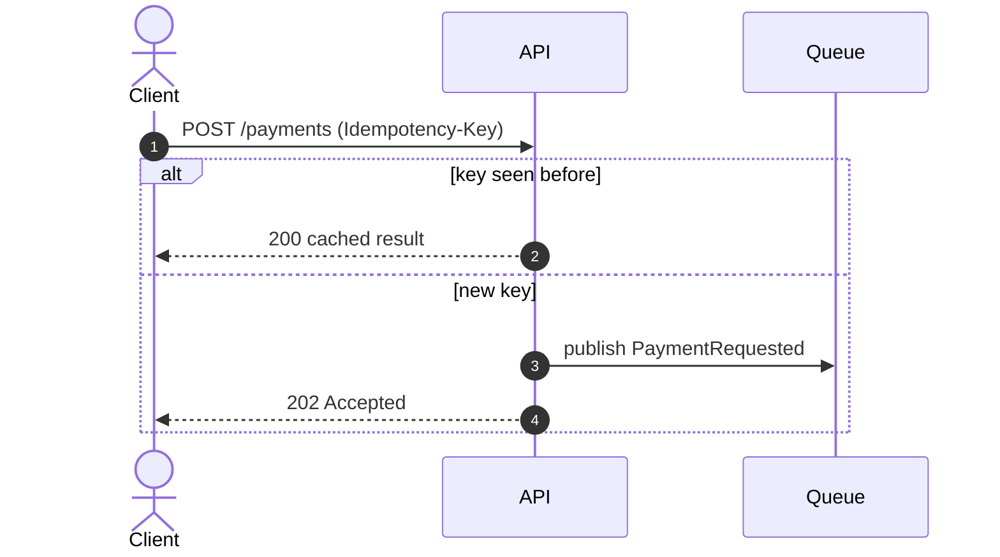
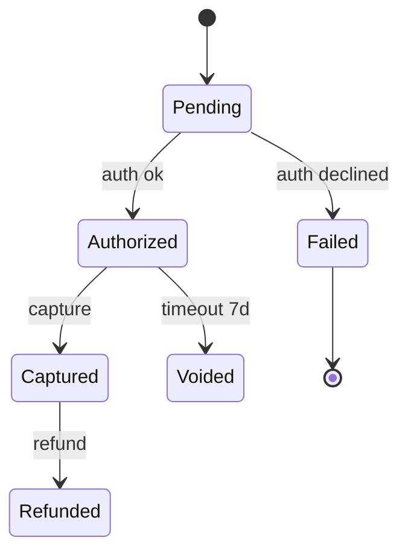

# Mermaid Conventions

Diagrams are code: they live in the markdown next to the text they explain and are reviewed like code.

## Which diagram for which question
| Question | Diagram | Mermaid type |
|----------|---------|--------------|
| What is the system and who/what talks to it? | System context (C4 L1) | `flowchart LR` |
| What are the deployable parts and how do they communicate? | Containers (C4 L2) | `flowchart TB` with `subgraph` |
| In what order do things happen for a flow, including errors? | Sequence | `sequenceDiagram` |
| What states can an entity be in? | State machine | `stateDiagram-v2` |
| What are the entities and relations? | ER | `erDiagram` |
| What are the classes/interfaces and patterns? | Class | `classDiagram` |
| How does a decision/algorithm branch? | Flowchart | `flowchart TD` |
| When will work happen? | Timeline | `gantt` |
| Where does it run? | Deployment | `flowchart LR` with `subgraph` per env/zone |

## Rules
- One idea per diagram; ≤ ~15 nodes. Split rather than cram.
- Node ids are short and alphanumeric (`api`, `db1`); put human text in labels: `api[Order API]`.
- Avoid characters that break parsing inside labels: wrap labels in quotes when they contain `()`, `:`, `/`, `#` — `a["POST /orders (v2)"]`.
- Label every edge with the verb or protocol: `api -->|gRPC| svc`.
- Shapes: `[(db)]` datastores, `([actor])` people, `[[queue]]` queues/topics, `{decision}` decisions.
- Never use `;` inside sequence-diagram messages or notes: it is a statement separator. Use commas.
- Validate diagrams for real with `devkit lint --render`, which needs `npm i -g @mermaid-js/mermaid-cli`.
- Sequence diagrams show the error path with `alt` / `opt` / `loop` blocks and use `-->>` for responses.
- Reference requirement IDs in notes where a flow realises a critical requirement: `Note over A,B: FR-003 (CRITICAL) idempotent`.
- Do not add a diagram that restates a table. Add one when relationships or ordering matter.

## Snippets

