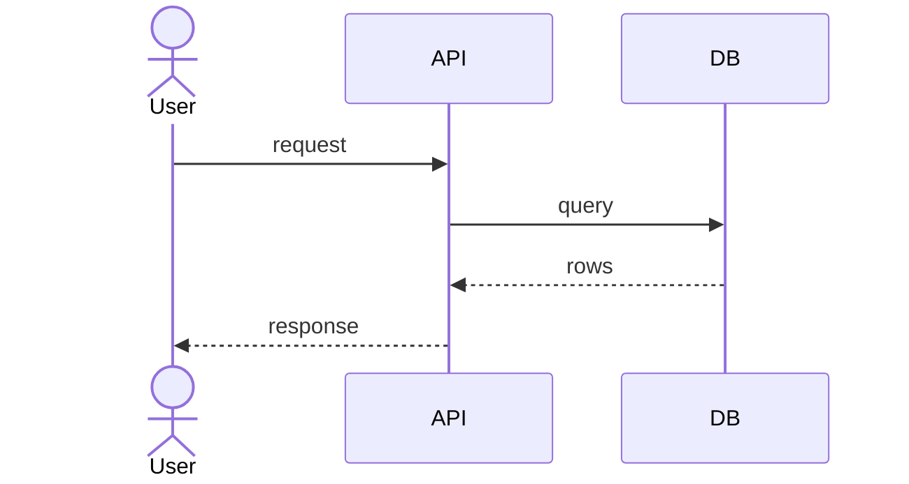
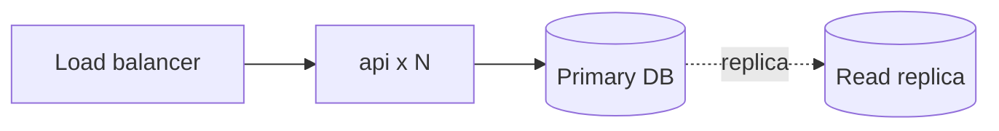

<!-- devkit:doc type=hld v=1 -->
# High-Level Design — {{title}}

**Status:** Draft
**Feature:** `{{slug}}` · **Updated:** {{date}} · **Upstream:** `../01-requirements/requirements.md`, `solutioning.md`, decision log

## 1. Overview
<!-- TODO: one paragraph — the chosen solution in plain words -->

## 2. Architecture decisions applied
Every ADR listed in solutioning §1 (constrains/complies) and §10, and where this design honours it.

| ADR | Decision | Where / how the design applies it |
|-----|----------|-----------------------------------|
<!-- TODO -->

## 3. System context (C4 level 1)
```mermaid
flowchart LR
  user([User]) -->|uses| sys[{{title}}]
  sys -->|calls| ext[(External system)]
```
<!-- TODO: replace with real actors and external systems -->

## 4. Containers / major components (C4 level 2)
```mermaid
flowchart TB
  subgraph boundary[{{title}}]
    api[API service]
    worker[Worker]
    db[(Database)]
  end
  api --> db
  worker --> db
```
<!-- TODO -->

| Component | Responsibility | Tech | Owns data | Scales by | Requirements |
|-----------|----------------|------|-----------|-----------|--------------|
<!-- TODO -->

## 5. Key flows
<!-- TODO: one sequence diagram per critical / Must flow -->


## 6. Data architecture
<!-- TODO: main entities, stores, ownership, retention, consistency model (strong/eventual), PII classification -->

## 7. Integration & interfaces
| Interface | Direction | Protocol | Sync/Async | Contract | SLA |
|-----------|-----------|----------|------------|----------|-----|
<!-- TODO -->

## 8. Deployment view

<!-- TODO: environments, regions, scaling, network boundaries -->

## 9. NFR realisation
How each NFR is met by the design. Every NFR must appear here.

| NFR | Design tactic | Component | How we verify |
|-----|---------------|-----------|---------------|
<!-- TODO -->

## 10. 🔴 Critical requirement guards
| Requirement | Guard (redundancy, validation, idempotency, audit…) | Failure mode handled |
|-------------|------------------------------------------------------|----------------------|
<!-- TODO -->

## 11. Cross-cutting concerns
- **Security:** <!-- TODO: authN/Z, secrets, encryption in transit/at rest, threat model summary -->
- **Observability:** <!-- TODO: logs (structured, correlation id), metrics, traces, alerts -->
- **Resilience:** <!-- TODO: timeouts, retries, circuit breakers, degradation modes -->
- **Configuration & feature flags:** <!-- TODO -->

## 12. Risks & mitigations
| Risk | Likelihood | Impact | Mitigation | Owner |
|------|------------|--------|------------|-------|
<!-- TODO -->

## 13. Open issues
<!-- TODO -->
