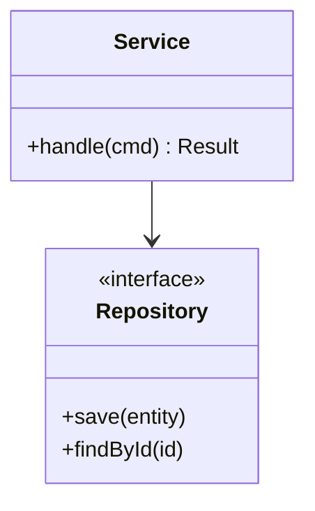
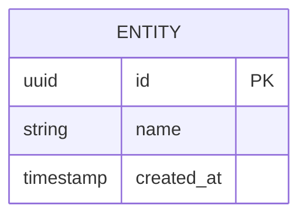
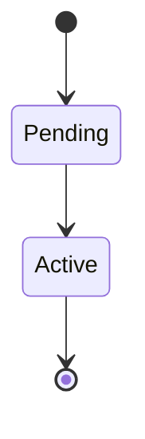

<!-- devkit:doc type=lld v=1 -->
# Low-Level Design — {{title}}

**Status:** Draft
**Feature:** `{{slug}}` · **Updated:** {{date}} · **Upstream:** `hld.md`

## 1. Module / package structure
```text
<!-- TODO: proposed source tree with one-line purpose per module -->
```

## 2. Class / module design

<!-- TODO: real classes, interfaces, and which design pattern each realises -->

| Module / class | Responsibility | Pattern | Requirements |
|----------------|----------------|---------|--------------|
<!-- TODO -->

## 3. API contracts
<!-- TODO: one block per endpoint / message -->
### `POST /resource`
- **Purpose / requirement:** FR-xxx
- **Auth:**
- **Request:**
```json
{}
```
- **Responses:** `201` …, `400` validation, `409` conflict, `5xx`
- **Idempotency:**
- **Rate limit:**

## 4. Data model

| Table / collection | Indexes | Partition / shard key | Retention | Migration |
|--------------------|---------|-----------------------|-----------|-----------|
<!-- TODO -->

## 5. State machines
<!-- TODO: for every entity with a lifecycle -->


## 6. Detailed flows
<!-- TODO: sequence diagrams including error paths, retries and timeouts -->

## 7. Algorithms & business rules
<!-- TODO: pseudo-code for non-trivial logic, with complexity (time/space) -->

## 8. Error handling
| Error | Detected where | Response / code | Retry? | Logged as | Alert? |
|-------|----------------|-----------------|--------|-----------|--------|
<!-- TODO -->

## 9. Concurrency, consistency & transactions
<!-- TODO: locking, isolation level, idempotency keys, ordering guarantees -->

## 10. Configuration
| Key | Default | Description | Secret? |
|-----|---------|-------------|---------|
<!-- TODO -->

## 11. Logging & metrics
<!-- TODO: log events (name, level, fields) — these feed the log-watcher profile; metrics with names and labels -->

## 12. Testability notes
<!-- TODO: seams for mocking, test data, what needs contract tests -->

## 13. Decisions applied
Implementation-level constraints that come from ADRs (repo-wide and feature).

| ADR | Constraint on implementation | Where applied (module / section) |
|-----|------------------------------|----------------------------------|
<!-- TODO -->
