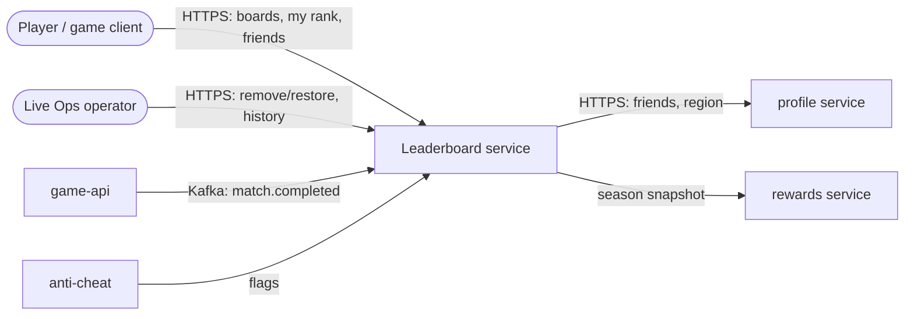
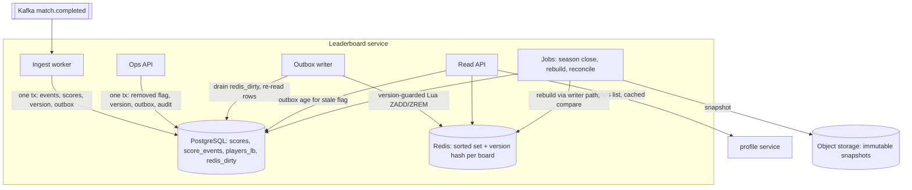
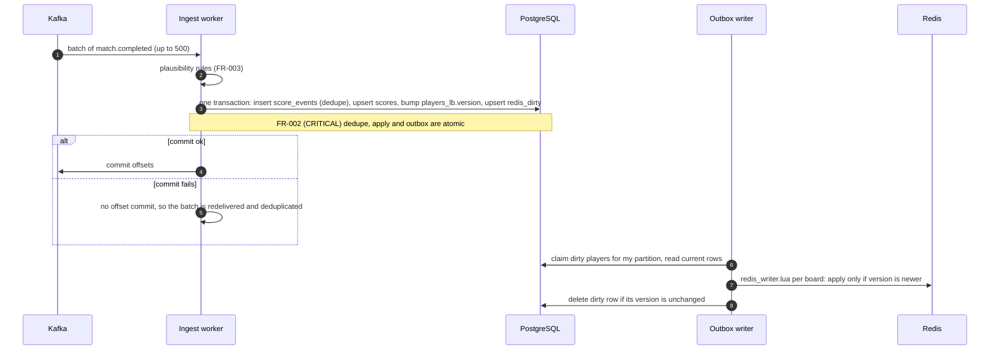
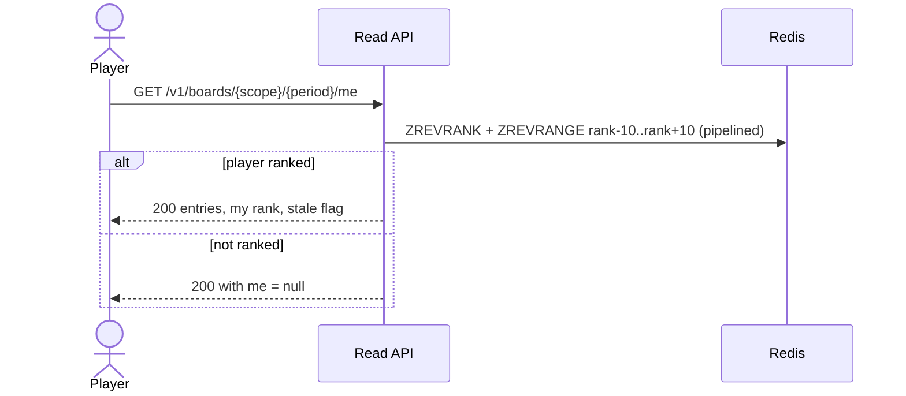
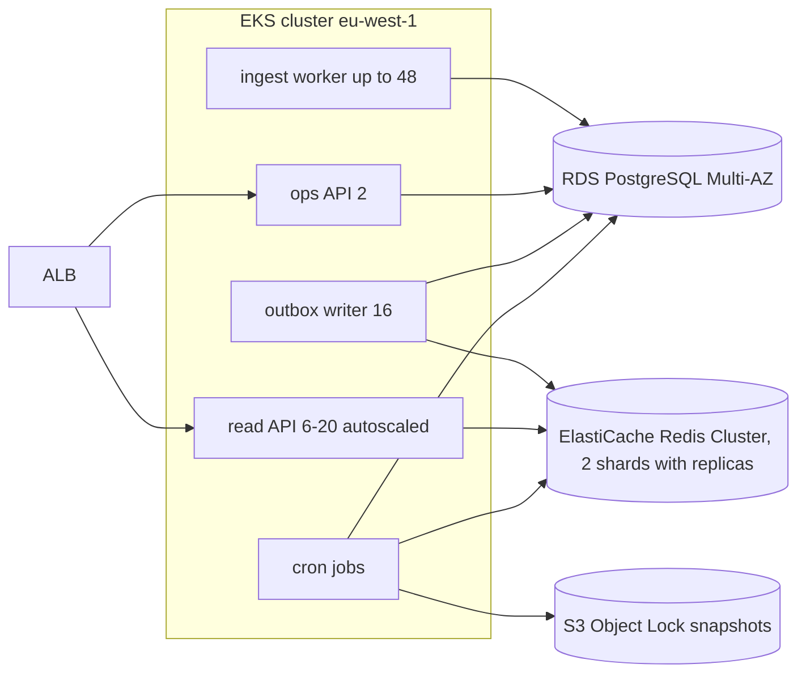

<!-- devkit:doc type=hld v=1 -->
# High-Level Design — Near-realtime Leaderboards

**Status:** Approved
**Feature:** `leaderboard` · **Updated:** 2026-10-08 · **Upstream:** `../01-requirements/requirements.md`, `solutioning.md`, decision log

## 1. Overview
A new **leaderboard service** consumes `match.completed` from Kafka.
- In one PostgreSQL transaction (the system of record), the **ingest worker** deduplicates and applies each event: it inserts a `score_events` row, upserts the scores, bumps the player's version and writes the `redis_dirty` outbox row.
- It never writes to Redis.
- A separate **outbox writer** drains `redis_dirty`. It re-reads the current PostgreSQL state and applies **version-guarded** Lua writes to one Redis sorted set per board (global and regions × season and all-time). This means no older value can ever overwrite a newer one.
- The **read API** serves top-100, around-me and friends from Redis, with a `stale` flag driven by outbox age.
- **Jobs** handle season close (an immutable snapshot from PostgreSQL), rebuild, and an hourly safety-net reconcile.

This is option A (A″) from solutioning, as decided in ADR-0006.

## 2. Architecture decisions applied
Every ADR listed in solutioning §1 (constrains/complies) and §10, and where this design honours it.

| ADR | Decision | Where / how the design applies it |
|-----|----------|-----------------------------------|
| ADR-0001 | PostgreSQL is the system of record | All scores, events, versions, removals, audit and snapshots live in PostgreSQL. Redis is derived and rebuildable (§6, rebuild job) |
| ADR-0002 | Kafka for domain events | The ingest worker consumes `match.completed` (consumer group `leaderboard-ingest`). Per-player ordering comes from the player_id key |
| ADR-0004 | Exactly-once via `score_events` keyed by (player_id, match_id) | Ingest transaction: `score_events` insert with ON CONFLICT DO NOTHING plus score upsert; Kafka offsets committed after the commit. It also provides permanent history (FR-012) |
| ADR-0006 | PostgreSQL truth with a Redis read model (outbox + version-guarded writes) | Only the outbox writer writes Redis, through `redis_writer.lua` (CAS on the per-board version hash). Removal and restore use the same path. The stale flag comes from outbox age |

## 3. System context (C4 level 1)

## 4. Containers / major components (C4 level 2)

| Component | Responsibility | Tech | Owns data | Scales by | Requirements |
|-----------|----------------|------|-----------|-----------|--------------|
| Ingest worker | Validate, dedupe and apply events; bump the version; write the outbox, all in one transaction | Python 3.12, aiokafka, asyncpg | scores, score_events, players_lb, redis_dirty | Kafka partitions (48) | FR-001, FR-002, FR-003, FR-007, FR-008, NFR-001, NFR-003 |
| Outbox writer | Drain `redis_dirty` by player hash partition; re-read PostgreSQL; version-guarded writes per board | Python worker + `redis_writer.lua` | — | 16 claim partitions | NFR-001, NFR-006, FR-011 |
| Read API | Top-N, around-me, friends board, stale flag | FastAPI | — (reads Redis) | Stateless pods | FR-004, FR-005, FR-006, FR-014, NFR-002 |
| Ops API | Remove/restore players with audit; score history | FastAPI, `lb-ops` role | operator_actions | 2 pods | FR-011, FR-012, NFR-008 |
| Season-close job | Freeze the snapshot from PostgreSQL at the cut-off; checksum; compare with Redis; publish | Python cron | season_snapshots | Per board | FR-009, FR-010 |
| Rebuild job | Build a shadow key through the version-guarded path; swap | Python CLI | — | Per board | FR-013, NFR-007 |
| Reconcile job | Hourly safety-net compare of Redis against PostgreSQL; enqueue mismatches into `redis_dirty` | Python cron | — | Per board | NFR-006 |
| PostgreSQL | System of record | PostgreSQL 15, `leaderboard` schema | all of the above | Vertical; partitioned `score_events` | ADR-0001, ADR-0004 |
| Redis | Ranking read model | Redis 7 Cluster; season and all-time boards on separate shards; replicas | derived boards and version hashes | Memory per board | ADR-0006, NFR-002, NFR-004 |

## 5. Key flows
Score update (FR-001, FR-002 CRITICAL, NFR-001, NFR-006):

Around-me read (FR-005, NFR-002):

## 6. Data architecture
- **PostgreSQL (system of record):**
  - `players_lb(player_id, region, removed, version, updated_at)`, with a monotonic per-player `version`;
  - `scores(player_id, period, season_id, score, reached_at)`;
  - `score_events` (ADR-0004): permanent, partitioned monthly;
  - `redis_dirty(player_id, version, enqueued_at)`, the outbox;
  - `operator_actions` (audit);
  - `season_snapshots`.
- **Redis (derived):** per board, a sorted set `lb:{<board>}` and a version hash `lbv:{<board>}`. They share the hash tag `{<board>}`, so they live in the same slot and a Lua script can update both atomically. `<board>` is `scope:period:season`, for example `global:season:2026-W41`.
- **Consistency:** PostgreSQL is strongly consistent. Redis converges on PostgreSQL, and is never ahead of it or older than it, because writes are version-guarded.
- **Staleness:** reads carry `stale = true` when the **oldest `redis_dirty` row is older than 60 s**, or while a shard is in post-failover replay (`redis_health.stale_until`). The read API caches both for 1 s. Either condition is an incident (NFR-006).
- **Retention:** the current and previous season boards stay in Redis; older seasons exist only as snapshots.
- **PII:** none in Redis. Display names are resolved at read time; only opaque handles are returned (NFR-009).

## 7. Integration & interfaces
| Interface | Direction | Protocol | Sync/Async | Contract | SLA |
|-----------|-----------|----------|------------|----------|-----|
| `match.completed` | in | Kafka | async | `services/game-api/src/events.py` | 7-day retention (ADR-0002) |
| Anti-cheat flags | in | Kafka topic `player.flagged` (proposed, Q3) | async | to be agreed | best effort |
| Read API | out (clients) | HTTPS/JSON | sync | LLD §3 | p95 ≤ 50 ms, 99.9 % |
| Ops API | out (ops tool) | HTTPS/JSON, `lb-ops` role | sync | LLD §3 | 99.5 % |
| Profile friends/region | out | HTTPS | sync, cached 5 min, circuit breaker | profile API v2 | p95 30 ms |
| Season snapshot | out (rewards) | object storage + `season.closed` event | async | LLD §3 | by Monday 00:15 UTC |

## 8. Deployment view

## 9. NFR realisation
| NFR | Design tactic | Component | How we verify |
|-----|---------------|-----------|---------------|
| NFR-001 | Ingest batches of 500 or 100 ms; outbox writer polls every 200 ms; one Lua call per board | Ingest worker, outbox writer | benchmark ingest-freshness (TC-020) |
| NFR-002 | O(log n) sorted-set queries, pipelining, 1 s top-100 cache | Read API, Redis | benchmark read-mix (TC-021) |
| NFR-003 | 48 partitions, batched transactions | Ingest worker, PostgreSQL | benchmark ingest-throughput (TC-022) |
| NFR-004 | About 4.5 GB per 40M-entry board plus about 40 % for the version hash; season and all-time on separate shards | Redis | T-002 load test |
| NFR-005 | Stateless read pods across 3 AZs; Redis replica failover | Read API, Redis | SLO dashboard |
| NFR-006 | Transactional outbox; version-guarded writes; stale flag from outbox age and failover state; failover replay with version bump; rebuild barrier and catch-up; hourly reconcile safety net | Ingest worker, outbox writer, jobs | chaos suite TC-010, TC-011, TC-013, TC-014 |
| NFR-007 | Rebuild through the version-guarded path into a shadow key, with dual-target writes during the rebuild, then RENAME | Rebuild job | rebuild drill TC-012 |
| NFR-008 | `lb-ops` role via SSO; every remove and restore audited, with a reason | Ops API | TC-015 |
| NFR-009 | Opaque handles; no PII in Redis | Read API | contract test TC-016 |
| NFR-010 | Shared PostgreSQL schema; Redis about $2.5k/month; itemised in T-002 | — | cost review |
| NFR-011 | Consumer lag and outbox-age metrics, with alerts | Ingest worker, outbox writer | alert test TC-017 |

## 10. 🔴 Critical requirement guards
| Requirement | Guard (redundancy, validation, idempotency, audit…) | Failure mode handled |
|-------------|------------------------------------------------------|----------------------|
| FR-002 | `score_events` unique on (player_id, match_id, completed_month) in the same transaction as the score update; offsets committed after the commit | Redelivery, replay, producer retries with new event ids, consumer crash at any point |
| FR-010 | Snapshot computed from PostgreSQL at the cut-off, removed players excluded, SHA-256 checksum, S3 Object Lock, compared with Redis before publishing | Redis drift at season end, tampering, late events, cheaters in the top 1 000 |
| NFR-006 | Transactional outbox plus version-guarded Redis writes, so no older value can land last; stale flag from outbox age; failover replay | Redis failover with lost acknowledgements, zombie consumers, removal racing a batch, rebuild racing live writes |

## 11. Cross-cutting concerns
- **Security:** the read API needs a player JWT; the ops API needs the `lb-ops` role via SSO; secrets come from the secrets manager; TLS everywhere.
- **Observability:**
  - JSON logs with `match_id` / `player_id` correlation;
  - metrics: consumer lag, outbox oldest age, apply rate, rejected rate, Redis latency, reconcile mismatches;
  - traces through ingest → PostgreSQL → outbox writer → Redis.
- **Resilience:**
  - timeouts of 50 ms (Redis) and 100 ms (profile);
  - a circuit breaker on profile;
  - ingest retries with backoff;
  - poison events go to a DLQ after 5 attempts.
- **Configuration & feature flags:** `MAX_DELTA` per game mode; a `leaderboard.enabled` client flag for a staged rollout.

## 12. Risks & mitigations
| Risk | Likelihood | Impact | Mitigation | Owner |
|------|------------|--------|------------|-------|
| Redis memory exceeds a node at 40M+ entries, including the version hash | Medium | High | Memory alert at 70 %; separate shards; sized in T-002 | Tech lead |
| A hot key on the global season board at 60k reads/s | High | Medium | 1 s top-100 cache in the read API; replica reads for around-me | Tech lead |
| Outbox writer lag during spikes | Medium | Medium | Partitioned writers; outbox-age alert; the stale flag shows it to players | Tech lead |
| Anti-cheat flag feed not ready (Q3) | Medium | Medium | Manual removal through the Ops API first | PM |

## 13. Open issues
- Q3: the format of the anti-cheat flag feed.
- Q4: region changes mid-season. The outbox path handles a ZREM from the old region board once a rule is decided.
- Whether rewards needs a `season.closed` event or polls the snapshot store.
