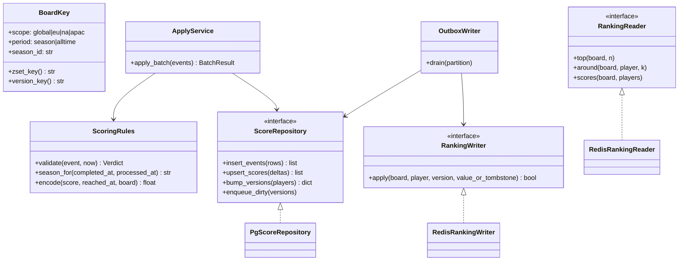
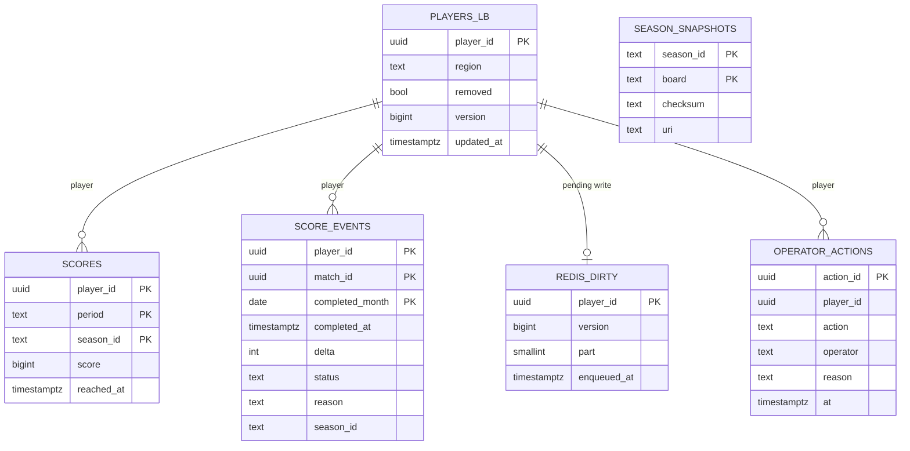
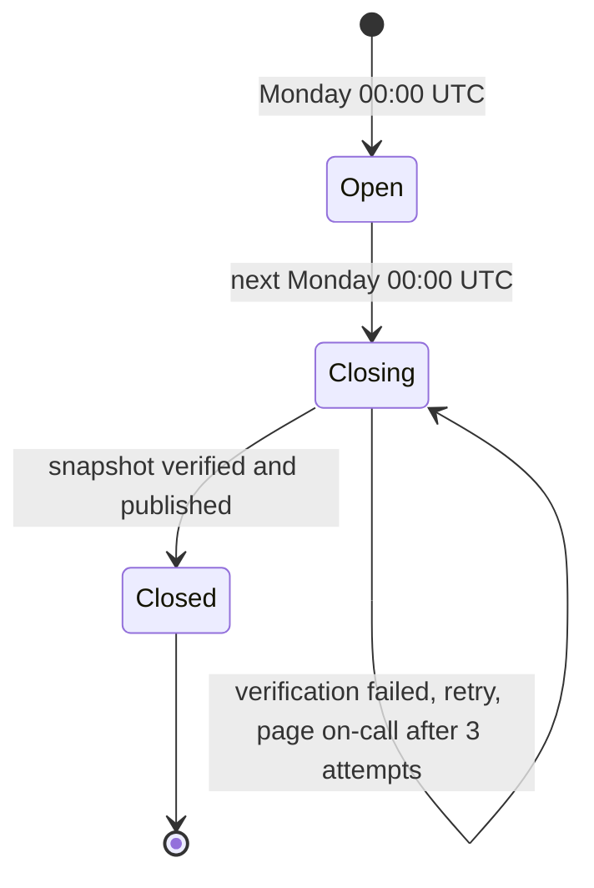
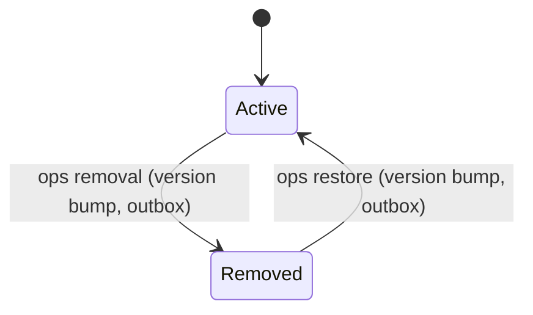

<!-- devkit:doc type=lld v=1 -->
# Low-Level Design — Near-realtime Leaderboards

**Status:** Approved
**Feature:** `leaderboard` · **Updated:** 2026-10-08 · **Upstream:** `hld.md`

## 1. Module / package structure
```text
services/leaderboard/
  src/leaderboard/
    domain/        boards.py (BoardKey, season maths), scoring.py (plausibility, tie-break encoding)
    ingest/        consumer.py (Kafka batch loop, offsets after commit), apply.py (single transaction: events, scores, version, outbox)
    writer/        outbox_writer.py (claim, re-read, apply, delete-if-unchanged), redis_writer.lua (per-board CAS)
    read/          api.py (FastAPI routes), queries.py (Redis queries), friends.py (profile client + breaker), staleness.py
    ops/           api.py (remove/restore/history), audit.py
    jobs/          season_close.py, rebuild.py, reconcile.py, failover_replay.py
    adapters/      pg.py (asyncpg pool, repositories), redis.py (cluster client, script loading), kafka.py
    config.py      settings (pydantic-settings)
  tests/           unit/, property/, integration/ (testcontainers PG, Redis Cluster, Redpanda), chaos/, contract/
  poc/             proof-of-concept used in solutioning (not production)
```

## 2. Class / module design


| Module / class | Responsibility | Pattern | Requirements |
|----------------|----------------|---------|--------------|
| `ingest/consumer.py` | Poll batches (500 events or 100 ms), call ApplyService, commit offsets after success | Competing consumers | FR-001, NFR-001, NFR-003 |
| `ingest/apply.py` ApplyService | Validate, then in one transaction: insert score_events, upsert scores, bump versions, enqueue dirty | Idempotent receiver, transactional outbox | FR-002, FR-003, FR-007, FR-008 |
| `domain/scoring.py` ScoringRules | Plausibility rules; event-time season assignment; tie-break encoding | Strategy (rules per game mode) | FR-003, FR-007, FR-009 |
| `writer/outbox_writer.py` OutboxWriter | Claim dirty rows per partition; re-read the current rows; call RankingWriter per board; delete the dirty row if its version is unchanged | Outbox to derived store | NFR-001, NFR-006, FR-011 |
| `writer/redis_writer.lua` | Per board: CAS on `lbv:{board}` and then ZADD or ZREM on `lb:{board}`, atomically | Versioned writes | NFR-006, ADR-0006 |
| `adapters/pg.py` PgScoreRepository | SQL for events, scores, versions, outbox, audit | Repository | ADR-0001, ADR-0004 |
| `read/*` RedisRankingReader | ZREVRANGE / ZREVRANK / ZMSCORE pipelines; stale flag from a 1 s in-process cache of (oldest outbox age, `redis_health.stale_until`), so no PostgreSQL query per request | Adapter, cache-aside | FR-004, FR-005, FR-006, NFR-002 |
| `read/friends.py` | Friends list from profile with a 5 min cache and a circuit breaker | Circuit breaker | FR-006 |
| `jobs/season_close.py` | Snapshot from PostgreSQL, checksum, compare with Redis, publish | — | FR-009, FR-010 |
| `jobs/rebuild.py` | Shadow build through RankingWriter, with dual-target writes, then an atomic swap | Blue/green swap | FR-013, NFR-007 |
| `jobs/reconcile.py` | Hourly compare; enqueue mismatched players into `redis_dirty` | Reconciliation | NFR-006 |
| `jobs/failover_replay.py` | Detect a primary change; mark the shard stale; enqueue players updated in the last 15 min with a version bump | — | NFR-006 |

## 3. API contracts
### `GET /v1/boards/{scope}/{period}/top?n=100`
- **Purpose / requirement:** FR-004.
- **Auth:** player JWT.
- **Response 200:**
```json
{"board": "global:season:2026-W41", "stale": false, "as_of": "2026-10-08T10:00:01Z",
 "entries": [{"rank": 1, "handle": "pl_8f2a", "name": "Kai", "score": 18250}]}
```
- **Errors:** 400 unknown scope/period, or n > 100; 503 when Redis is unavailable (never an answer from another source).
- **Rate limit:** 20 req/s per player.

### `GET /v1/boards/{scope}/{period}/me?k=10`
- **Purpose / requirement:** FR-005.
- **Response 200:** same shape as above, plus `"me": {"rank": 5000, "score": 912}`. An unranked player gets `"me": null` and an empty `entries`.

### `GET /v1/boards/friends/{period}`
- **Purpose / requirement:** FR-006.
- **Response:** the player and their friends, with ranks 1..n among them. `"degraded": true` when the friends list came from a stale cache.

### `POST /v1/ops/players/{player_id}/removal` and `DELETE …/removal`
- **Purpose / requirement:** FR-011, NFR-008.
- **Auth:** `lb-ops` role.
- **Request (both):** `{"reason": "anti-cheat case 812"}`. The reason is required for both remove and restore.
- **Response:** 202 `{"action_id": "..."}`. Both go through the outbox and take effect on every board within NFR-006 bounds (well under 5 min). Both are audited with operator, reason and time.
- **Idempotency:** repeating an action already in effect returns 200 with the existing action.

### `GET /v1/ops/players/{player_id}/history?cursor=`
- **Purpose / requirement:** FR-012.
- **Response:** applied, rejected and late `score_events`, newest first, paginated with a cursor.

## 4. Data model

| Table / collection | Indexes | Partition / shard key | Retention | Migration |
|--------------------|---------|-----------------------|-----------|-----------|
| players_lb | PK player_id; (updated_at) for failover replay | — | forever | new schema `leaderboard` |
| scores | PK (player_id, period, season_id); (season_id, period, score desc, reached_at) for snapshots | list-partitioned by period | current + previous season; all-time forever | new |
| score_events | PK (player_id, match_id, completed_month); (player_id, completed_at) for history | `PARTITION BY RANGE (completed_month)`. `completed_month` is a plain column set by the application, because PostgreSQL does not allow generated columns in partition keys | 13 months hot, then archived to S3 (ADR-0004) | new |
| redis_dirty | PK player_id; (part, enqueued_at); `claimed_by`, `claimed_at` | — | deleted when applied at an unchanged version | new |
| rebuild_targets | PK board; `started_at`, `phase` (dual_write, loading, catch_up, swapping) | — | removed after the swap | new |
| rebuild_targets_ack | PK (board, writer_id); `observed_at` | — | removed with the target | new |
| redis_health | PK shard; `stale_until`, `last_role_change` | — | current state only | new |
| operator_actions | (player_id, at) | — | 2 years (audit) | new |
| season_snapshots | PK | — | forever | new |
| Redis `lb:{board}` and `lbv:{board}` | sorted set and version hash; shared hash tag, so the same slot | season boards on shard 1, all-time on shard 2 | current + previous season | built by the rebuild job |

## 5. State machines

Season lifecycle. Invalid transitions, for example Closed → Open, are rejected by `boards.py`.


Player board status. Removed players keep accumulating scores in PostgreSQL, but the writer issues a tombstone (ZREM) for every board.

## 6. Detailed flows
- **Apply batch (ingest worker):**
  1. `BEGIN`.
  2. `INSERT INTO score_events (…) VALUES … ON CONFLICT (player_id, match_id, completed_month) DO NOTHING RETURNING player_id, delta, status, season_id, completed_at`, which gives the newly inserted rows. Rejected events (FR-003) are inserted with `status = 'rejected'`.
  3. For the new applied rows, aggregated per (player, period, season): `INSERT INTO scores … ON CONFLICT DO UPDATE SET score = scores.score + excluded.score, reached_at = GREATEST(scores.reached_at, excluded.reached_at)`. `reached_at` is the event's `completed_at`, never `now()`, so replays are deterministic.
  4. `UPDATE players_lb SET version = version + 1, updated_at = now() WHERE player_id = ANY($touched) RETURNING player_id, version`, followed by `INSERT INTO redis_dirty (player_id, version, part, enqueued_at) … ON CONFLICT (player_id) DO UPDATE SET version = excluded.version`.
  5. `COMMIT`. Steps 2–4 are a single transaction (ADR-0004, ADR-0006).
  6. Commit the Kafka offsets.
- **Outbox writer (partition `p` of 16):**
  1. Claim in a **short** transaction, so ingest upserts never wait on a long lock: `UPDATE redis_dirty SET claimed_by = $me, claimed_at = now() WHERE player_id IN (SELECT player_id FROM redis_dirty WHERE part = p AND (claimed_at IS NULL OR claimed_at < now() - interval '30 s') ORDER BY enqueued_at LIMIT 500 FOR UPDATE SKIP LOCKED) RETURNING player_id, version`. Then commit.
  2. Read the current `players_lb` and `scores` rows for those players.
  3. For each player and each of their boards, call `redis_writer.lua` with KEYS `lb:{board}` and `lbv:{board}` and ARGV (player, version, value or tombstone).
  4. `DELETE FROM redis_dirty WHERE player_id = $1 AND version = $2`. A newer version enqueued in the meantime stays in the queue.
- **Removal and restore (ops API):** in one transaction, set `removed`, bump the version, upsert `redis_dirty`, and insert into `operator_actions` (with operator and reason). The writer then tombstones or re-adds the player on every board. Because the version increased, no in-flight older value can resurrect a removed player (FR-011).
- **Season close:**
  1. At Monday 00:00:00 UTC, the season moves to Closing.
  2. Wait for the grace period (5 min, A5), then wait until no `redis_dirty` row has `enqueued_at` ≤ cut-off + grace. The outbox has no season column, so the enqueue time is the barrier.
  3. In a REPEATABLE READ snapshot, read the closed season's scores for players with `removed = false`. Order them by `score DESC, tie_bucket(reached_at) ASC, player_id DESC`, where `tie_bucket` truncates to the second for season boards. That is exactly the granularity of the Redis encoding (§7).
  4. Compute SHA-256 and compare the top 1 000 with `ZREVRANGE lb:{board} 0 999`.
  5. **Only if they match**, write to S3 with Object Lock, insert the `season_snapshots` row and publish `season.closed`. If not, retry after 1 min, and page after 3 attempts. Nothing immutable is written before verification.
- **Rebuild of board B:**
  1. Insert B into `rebuild_targets` with `phase = dual_write` and `started_at = now()`. Writers re-read `rebuild_targets` on every poll (200 ms), and from then on apply each write to **both** the live and the shadow key pairs (`lb:{B}`/`lbv:{B}` and `lb:{B}:shadow`/`lbv:{B}:shadow`, all in the same slot).
  2. **Barrier:** wait 5 × the poll interval (1 s) so that every writer has observed the target. Each writer records `observed_at` in `rebuild_targets_ack`, and the rebuild waits until all 16 writers have acknowledged.
  3. `phase = loading`: stream all of B's rows from PostgreSQL through the same Lua script into the shadow pair, using each player's current version. The CAS makes the order irrelevant: the newest version always wins.
  4. `phase = catch_up`: re-stream every player with `updated_at ≥ started_at − 1 s` into the shadow pair, which closes any window before the barrier. Then verify the count and a sample of ranks against PostgreSQL.
  5. `phase = swapping`: one Lua script RENAMEs both shadow keys onto the live keys atomically, with `lazyfree-lazy-server-del yes`. Writers already write both pairs, so nothing is lost across the swap.
  6. Remove B from `rebuild_targets`.
- **Redis failover:** `failover_replay.py` polls `CLUSTER NODES` and the replication role every 5 s. On a primary change for a shard:
  1. Set `redis_health.stale_until = now() + 5 min` for that shard. The read API then serves `stale = true` for its boards.
  2. Enqueue the players with `updated_at > now() − 15 min` into `redis_dirty`, **bumping their version**, so the guard accepts the replay even where the version hash survived.
  3. Once the outbox has drained those rows, clear `stale_until`.
- **Reconcile repair:** a mismatch found by the hourly reconcile bumps the player's version and enqueues it, because the guard rejects equal versions.

## 7. Algorithms & business rules
- **Plausibility (FR-003):**
  - reject when `delta < 0` or `delta > MAX_DELTA[game_mode]` (default 5 000);
  - reject when the player is flagged;
  - reject when `completed_at` is more than 5 min in the future (clock skew), or older than 8 days (beyond Kafka's 7-day retention, so it cannot be a legitimate replay);
  - rejected events are stored in `score_events` with `status = 'rejected'` and a reason, so they are never retried and appear in the history.
- **Season assignment (FR-009, A5):** an event belongs to the season that contains its `completed_at`. If it is processed after that season's close plus the 5 min grace, it counts toward the current season instead, and is stored with `status = 'late_rollover'`.
- **Tie-break encoding (FR-007):** Redis orders by a double, highest first.
  - `value = score × 2^B + (2^B − 1 − t)`. For season boards, `t` is seconds since the season start, with `B = 20` (604 800 < 2^20). For all-time boards, `t` is minutes since 2024-01-01, with `B = 26`.
  - The value must stay below 2^53, which caps scores at 2^33 for season boards and 2^27 (134M) for all-time boards. An overflow is logged and alerted. The player is ranked at the cap until the encoding moves to a 2-key scheme. T-002 checks this cap against the real all-time score distribution.
  - Equal values (same score and same `tie_bucket`: the second for season boards, the minute for all-time) return in **descending** member (player_id) order from ZREVRANGE. Snapshots use the same ordering, `score DESC, tie_bucket ASC, player_id DESC`, so Redis and snapshots agree exactly.
- **`redis_writer.lua` (per board):**
  ```text
  cur = HGET lbv:{board} player  (or -1)
  if version <= cur: return 0
  HSET lbv:{board} player version
  if tombstone: ZREM lb:{board} player  else: ZADD lb:{board} value player
  return 1
  ```
- **Around-me:** `r = ZREVRANK`, then `ZREVRANGE key max(0, r−k) r+k WITHSCORES`, pipelined: O(log n + 2k).
- **Friends board:** `ZMSCORE` over at most 501 members, sorted in the API: O(m log n).

## 8. Error handling
| Error | Detected where | Response / code | Retry? | Logged as | Alert? |
|-------|----------------|-----------------|--------|-----------|--------|
| Implausible delta or bad timestamp | ScoringRules | event stored with status rejected | no | WARN `score_rejected` | if > 20/min (`implausible-score-burst`) |
| Duplicate event | apply (ON CONFLICT) | skipped | no | DEBUG `event_duplicate` | if > 100/min |
| PostgreSQL unavailable | apply | batch not committed, offsets not committed | yes, backoff up to 30 s | ERROR `apply_failed` | lag > 5 s for 1 min |
| Redis write failure | outbox writer | dirty row kept, retried with backoff | yes | WARN `redis_write_failed` | if the oldest dirty row is > 60 s (stale incident) |
| Redis unavailable on read | read API | 503 | client retry | ERROR `ranking_unavailable` | yes |
| Profile timeout | friends.py | degraded friends board from cache | breaker half-open after 30 s | WARN `profile_degraded` | if the breaker is open > 5 min |
| Poison event (schema) | consumer | sent to DLQ after 5 attempts | no | ERROR `event_poison` | yes |
| Encoding overflow | ScoringRules.encode | ranked at the cap | no | ERROR `score_encoding_overflow` | yes |
| Snapshot mismatch against Redis | season_close | retry 3 times, then page | yes | ERROR `snapshot_verify_failed` | page |

## 9. Concurrency, consistency & transactions
- Kafka key = player_id, so a given player's events are applied in order by one worker.
- The apply transaction uses READ COMMITTED. The score upsert is a commutative sum; the version bump serialises per player through the row lock.
- Offsets are committed after the commit, so a crash causes redelivery, which `score_events` deduplicates (FR-002).
- Several writers can touch Redis: outbox writers, the rebuild loader, the failover replay and reconcile enqueues. All of them go through `redis_writer.lua`, whose CAS on the per-board version means **an older value can never land after a newer one**.
- `FOR UPDATE SKIP LOCKED` on `redis_dirty` gives each dirty player to one writer at a time. Delete-if-unchanged keeps newer enqueues.
- Each board's key pair shares a hash tag, so the CAS and the ZADD/ZREM are atomic in one slot. Boards are versioned independently; a player's boards may converge milliseconds apart, which is within NFR-006.

## 10. Configuration
| Key | Default | Description | Secret? |
|-----|---------|-------------|---------|
| `LB_MAX_DELTA` | `{"default": 5000}` | plausibility limit per game mode | no |
| `LB_BATCH_SIZE` / `LB_BATCH_MS` | 500 / 100 | ingest batching | no |
| `LB_OUTBOX_PARTITIONS` / `LB_OUTBOX_POLL_MS` | 16 / 200 | outbox writer partitions / poll interval | no |
| `LB_STALE_AFTER_S` | 60 | stale flag threshold (oldest dirty row) | no |
| `LB_RECONCILE_EVERY_S` | 3600 | safety-net reconcile period | no |
| `LB_FAILOVER_REPLAY_MIN` | 15 | replay window after a Redis failover | no |
| `LB_SEASON_GRACE_S` | 300 | late-event window at season close | no |
| `LB_PG_DSN` | — | PostgreSQL DSN | yes |
| `LB_REDIS_URL` | — | Redis Cluster seed nodes | yes |

## 11. Logging & metrics
- **JSON logs.** Lines carry `match_id`, `player_id`, `board` and `batch_id` where applicable. Events:
  - `score_applied` (DEBUG), `score_rejected` (WARN), `event_duplicate` (DEBUG), `apply_failed` (ERROR);
  - `redis_write_failed` (WARN), `ranking_unavailable` (ERROR), `profile_degraded` (WARN), `event_poison` (ERROR);
  - `score_encoding_overflow` (ERROR), `snapshot_verify_failed` (ERROR);
  - `player_removed` / `player_restored` (INFO, audit).
- **Metrics:**
  - `lb_consumer_lag_seconds`, `lb_events_applied_total{result}`, `lb_outbox_oldest_age_seconds` (drives the stale flag);
  - `lb_redis_latency_ms`, `lb_reconcile_mismatch_total{board}`, `lb_read_latency_ms{endpoint}`.

## 12. Testability notes
- `ScoreRepository`, `RankingWriter` and `RankingReader` are interfaces, so unit tests use in-memory fakes. The PoC `MemoryBoard` is reused for the reader fake.
- Property tests:
  - the encoded order matches (score desc, reached_at asc, player_id desc);
  - for random interleavings of versioned writes, the final Redis state equals the highest version.
- Integration tests use testcontainers: PostgreSQL 15, a Redis 7 cluster, and Redpanda as Kafka.
- Chaos hooks are env flags that:
  - crash the worker after the commit (before or after the offset commit);
  - crash the outbox writer between ZADD and DELETE;
  - drop Redis acknowledgements;
  - race a removal with an in-flight batch;
  - run a rebuild under live ingest.

## 13. Decisions applied
Implementation-level constraints that come from ADRs (repo-wide and feature).

| ADR | Constraint on implementation | Where applied (module / section) |
|-----|------------------------------|----------------------------------|
| ADR-0001 | No score exists only in Redis; every Redis value is derived from current PostgreSQL rows | `writer/outbox_writer.py`, `jobs/rebuild.py`, §6 |
| ADR-0002 | Consume `match.completed` keyed by player_id; the plausibility age limit matches the 7-day retention | `ingest/consumer.py`, §7, §9 |
| ADR-0004 | `score_events` insert (natural key) and the score upsert in one transaction; offsets after the commit | `ingest/apply.py`, §4, §6, §9 |
| ADR-0006 | Only `redis_writer.lua` writes to Redis, version-guarded per board; outbox in the apply transaction; stale flag from outbox age; no ZINCRBY | `writer/`, `read/staleness.py`, §6, §7, §9 |
