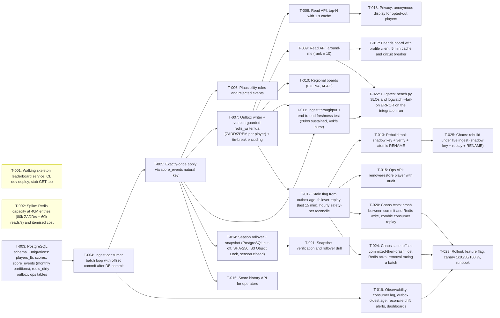

<!-- devkit:doc type=board v=1 generated -->
# Task Board — Near-realtime Leaderboards

_Generated by `devkit/tools/tracker.py` — do not edit by hand._

**Progress:** `░░░░░░░░░░` 0/25 tasks (0%) · 0/49 points

## 🚧 In progress (2)

| ID | Title | Type | Pri | Est | Depends on | Requirements | Owner |
|----|-------|------|-----|-----|------------|--------------|-------|
| T-001 | Walking skeleton: leaderboard service, CI, dev deploy, stub GET top | infra | P0 | S | - | FR-004 | - |
| T-002 | Spike: Redis capacity at 40M entries (80k ZADD/s + 60k reads/s) and itemised cost | spike | P0 | M | - | NFR-002, NFR-004, NFR-010 | - |

## ✅ Ready to start (1)

| ID | Title | Type | Pri | Est | Depends on | Requirements | Owner |
|----|-------|------|-----|-----|------------|--------------|-------|
| T-003 | PostgreSQL schema + migrations: players_lb, scores, score_events (monthly partitions), redis_dirty outbox, ops tables | infra | P0 | M | - | FR-001, FR-002, FR-012 | - |

## ⏳ Waiting on dependencies (22)

| ID | Title | Type | Pri | Est | Depends on | Requirements | Owner |
|----|-------|------|-----|-----|------------|--------------|-------|
| T-004 | Ingest consumer batch loop with offset commit after DB commit | feature | P0 | M | T-003 | FR-001, NFR-001 | - |
| T-005 | Exactly-once apply via score_events natural key | feature | P0 | M | T-004 | FR-002 | - |
| T-006 | Plausibility rules and rejected events | feature | P0 | S | T-005 | FR-003 | - |
| T-007 | Outbox writer + version-guarded redis_writer.lua (ZADD/ZREM per player) + tie-break encoding | feature | P0 | M | T-005 | FR-007, NFR-006 | - |
| T-008 | Read API: top-N with 1 s cache | feature | P1 | S | T-007 | FR-004, NFR-002 | - |
| T-009 | Read API: around-me (rank ± 10) | feature | P0 | S | T-007 | FR-005 | - |
| T-010 | Regional boards (EU, NA, APAC) | feature | P1 | S | T-007 | FR-008 | - |
| T-011 | Ingest throughput + end-to-end freshness test (20k/s sustained, 40k/s burst) | test | P0 | S | T-005, T-007 | NFR-003, NFR-001 | - |
| T-012 | Stale flag from outbox age, failover replay (last 15 min), hourly safety-net reconcile | feature | P0 | M | T-007 | NFR-006 | - |
| T-013 | Rebuild tool: shadow key + verify + atomic RENAME | feature | P1 | M | T-012 | FR-013, NFR-007 | - |
| T-014 | Season rollover + snapshot (PostgreSQL cut-off, SHA-256, S3 Object Lock, season.closed) | feature | P0 | M | T-005 | FR-009, FR-010 | - |
| T-015 | Ops API: remove/restore player with audit | feature | P1 | M | T-012 | FR-011, NFR-008 | - |
| T-016 | Score history API for operators | feature | P2 | S | T-005 | FR-012 | - |
| T-017 | Friends board with profile client, 5 min cache and circuit breaker | feature | P2 | M | T-009 | FR-006 | - |
| T-018 | Privacy: anonymous display for opted-out players | feature | P3 | S | T-008 | FR-014, NFR-009 | - |
| T-019 | Observability: consumer lag, outbox oldest age, reconcile drift, alerts, dashboards | infra | P1 | S | T-004 | NFR-011, NFR-005 | - |
| T-020 | Chaos tests: crash between commit and Redis write, zombie consumer replay | test | P0 | M | T-012 | NFR-006, FR-002 | - |
| T-021 | Snapshot verification and rollover drill | test | P0 | S | T-014 | FR-010 | - |
| T-022 | CI gates: bench.py SLOs and logwatch --fail-on ERROR on the integration run | chore | P2 | S | T-009, T-011 | NFR-002 | - |
| T-023 | Rollout: feature flag, canary 1/10/50/100 %, runbook | chore | P1 | S | T-019, T-020, T-024 | NFR-005 | - |
| T-024 | Chaos suite: offset-committed-then-crash, lost Redis acks, removal racing a batch | test | P0 | M | T-012 | NFR-006, FR-011 | - |
| T-025 | Chaos: rebuild under live ingest (shadow key + replay + RENAME) | test | P1 | S | T-013 | NFR-007, NFR-006 | - |

## Dependency graph

## Execution waves

Tasks in the same wave can run in parallel.

- **Wave 1:** T-001, T-002, T-003
- **Wave 2:** T-004
- **Wave 3:** T-005, T-019
- **Wave 4:** T-006, T-007, T-014, T-016
- **Wave 5:** T-008, T-009, T-010, T-011, T-012, T-021
- **Wave 6:** T-013, T-015, T-017, T-018, T-020, T-022, T-024
- **Wave 7:** T-023, T-025

**Critical path (19 points remaining):** T-003 → T-004 → T-005 → T-007 → T-012 → T-024 → T-023
