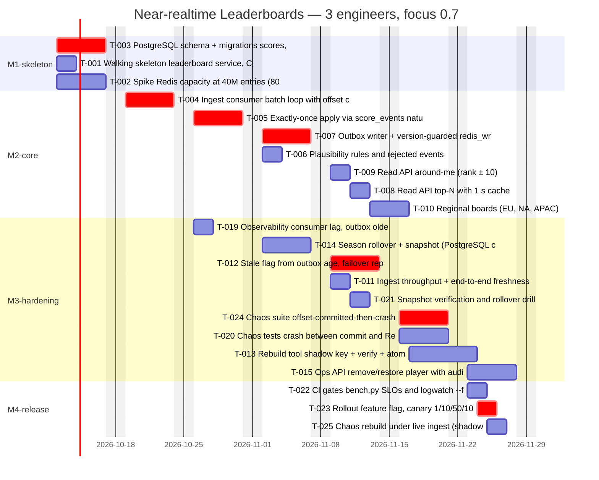

<!-- devkit:doc type=execution-plan v=1 -->
# Execution Plan — Near-realtime Leaderboards

**Status:** Review
**Feature:** `leaderboard` · **Updated:** 2026-10-08 · **Upstream:** `tasks.json` (`TASKS.md`)

## 1. Summary
- **Scope:** 25 tasks, 48 points in total. 21 tasks (42 points) go to launch; 3 tasks (FR-006 friends, FR-012 history, FR-014 privacy display) are deferred to M5-post-launch.
- **Plan:** 3 engineers at 70 % focus from Mon 2026-10-12, with 1 point ≈ 1 ideal day.
- **Schedule:** `tracker.py schedule` finishes on **2026-11-27**, **7 calendar days after** the 6-week target of 2026-11-20. Even with 4 engineers it misses by 4 days, because the critical path is 19 points of strictly sequential work.
- **Decision required, and recommended:** 10 % canary on 2026-11-20 behind the feature flag, with GA on 2026-11-27 after the chaos suite (T-024) passes. Dropping the chaos suite to hit 20 Nov is **not** recommended: it is the verification for the CRITICAL NFR-006.

## 2. Milestones
| Milestone | Exit criteria | Tasks | Target date |
|-----------|---------------|-------|-------------|
| M1 skeleton | Service deployed to dev from CI; schema migrated; **T-002 Redis capacity gate passed** (or the fallback triggered) | T-001, T-002, T-003 | 2026-10-16 |
| M2 core | Events applied exactly once; outbox writer live; top-100 and around-me served from Redis in dev | T-004–T-010 | 2026-11-16 |
| M3 hardening | Throughput and freshness gates pass; chaos suite green; season close and snapshot drill pass; removal and restore audited | T-011–T-015, T-019–T-021, T-024 | 2026-11-27 |
| M4 release | CI gates (bench SLOs, `logwatch --fail-on ERROR`); runbook; canary 1→10→50→100 % | T-022, T-023, T-025 | canary 2026-11-20, GA 2026-11-27 |
| M5 post-launch | Friends board, score history, anonymous display | T-016, T-017, T-018 | 2026-12-11 |

## 3. Waves (from `tracker.py waves`)
- **Wave 1:** T-001, T-002, T-003, all in parallel. T-002 is a spike, so it may start before the readiness gate.
- **Waves 2–4:** T-004 → T-005, then T-006, T-007, T-014 and T-019 fan out.
- **Waves 5–6:** reads (T-008 to T-010), hardening (T-011, T-012, T-021), then rebuild, ops and chaos (T-013, T-015, T-020, T-024).
- **Last:** rollout T-023 (needs T-019, T-020 and T-024), the CI gates T-022, and the rebuild chaos test T-025.
- The full list is in `TASKS.md`.

## 4. Timeline
Generated by `tracker.py schedule --start 2026-10-12 --team 3 --focus 0.7 --phases M1-skeleton,M2-core,M3-hardening,M4-release --mermaid`:

## 5. Critical path
- **The path:** T-003 → T-004 → T-005 → T-007 → T-012 → T-024 → T-023, 19 points or about 28 working days.
- **Slips:** any slip on these tasks moves the release date one for one.
- **Buffer:** none against 20 Nov, which is why canary and GA are split. Keep the most experienced engineer (eng1 in the schedule) on the path.
- **Early warning:** T-002 is the decision gate for ADR-0006. If it fails, the fallback adds about 1 week (shard split and replica reads).

## 6. Resourcing & ownership
- **eng1:** critical path (ingest, outbox writer, stale flag, chaos suite).
- **eng2:** skeleton, observability, reads, rebuild, rollout.
- **eng3:** Redis spike, season close and snapshots, throughput tests, CI gates.
- **External:** Live Ops (approvals, the Q1 answer), game-api (stable `match_id` across retries, ADR-0004), anti-cheat (Q3), SRE (Redis Cluster provisioning by 2026-10-14).

## 7. Risks to delivery
| Risk | Trigger | Mitigation | Contingency |
|------|---------|------------|-------------|
| Redis capacity gate fails | T-002 shows p95 > 5 ms or single-key CPU > 70 % | Dedicated shard for global boards; replica reads | Re-evaluate Option B with the T-002 data (ADR-0006 fallback) |
| Critical path slips | Any critical task runs more than 1 day over | Daily check of `tracker.py waves`; pair on T-007 | Move GA a week; the canary stays on 20 Nov |
| game-api reuses or regenerates `match_id` | Contract test fails | Agree the contract in week 1 | Dedupe on event_id plus match_id |
| SRE provisioning delay | Redis Cluster not ready by 10-14 | Request on day 1 | Run T-002 on self-managed Redis in staging |
| Anti-cheat feed not ready (Q3) | No topic by M3 | Manual removal through the Ops API | Launch without automated flags |

## 8. Rollout plan
1. Environments: dev → staging, with a load test at target scale → production.
2. The `leaderboard.enabled` client flag gates the rollout: canary 1 % → 10 % (20 Nov) → 50 % → 100 % (27 Nov).
3. Each step is gated by SLOs:
   - read p95 ≤ 50 ms (NFR-002);
   - freshness p95 ≤ 2 s (NFR-001);
   - outbox age ≤ 60 s with no stale incidents (NFR-006);
   - error rate ≤ 0.1 %.
4. Data runs expand-only: new schema and tables, with no changes to existing services. Board backfill comes from match history through the rebuild job before the canary.
5. Comms: Live Ops briefed before the canary; a status page entry for the season-one launch.

## 9. Rollback plan
- **Triggers:** any SLO gate breached for 10 minutes, a stale incident over 5 minutes, or a snapshot verification failure.
- **Steps:**
  1. Turn the client flag off (instant).
  2. Stop the outbox writer if Redis is suspected.
  3. Keep ingest running: PostgreSQL stays correct, so there is no data loss.
- **Data recovery:** rebuild the boards from PostgreSQL (T-013). Snapshots are immutable.
- **Owner:** the leaderboard on-call (tech lead), with SRE.

## 10. Definition of done
- [ ] All Must FRs implemented with passing acceptance tests
- [ ] All CRITICAL requirements covered by tests (`tracker.py validate` clean)
- [ ] Benchmarks meet NFR SLOs (`bench.py` gates pass)
- [ ] Log watcher shows no ERROR/critical alerts in a full local test run
- [ ] Docs and runbook updated
- [ ] T-002 capacity gate recorded in ADR-0006 (pass, or fallback taken)
- [ ] Chaos suite (T-020, T-024, T-025): zero rank mismatches against PostgreSQL within 60 s
- [ ] Season close drill (T-021) passes before the first Monday after GA
